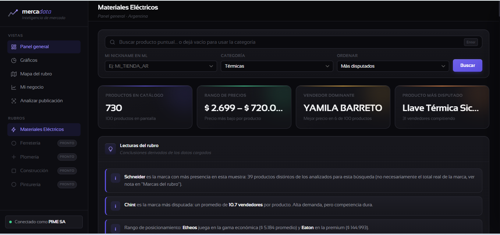
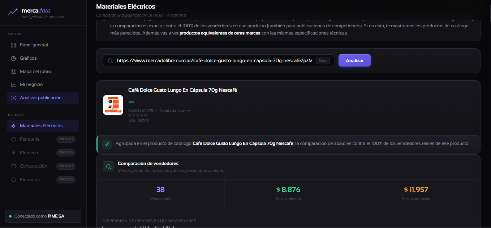
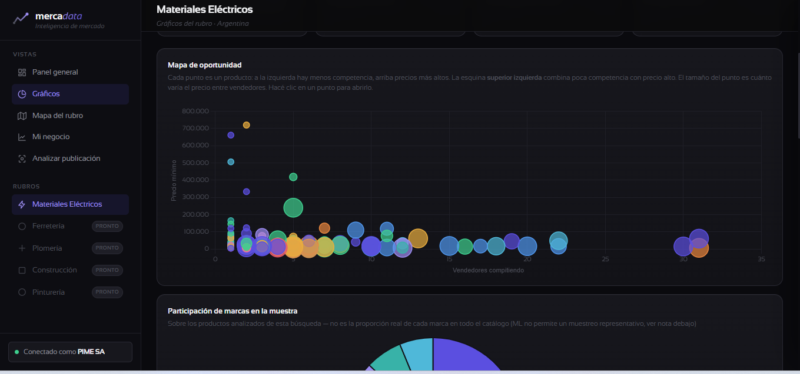
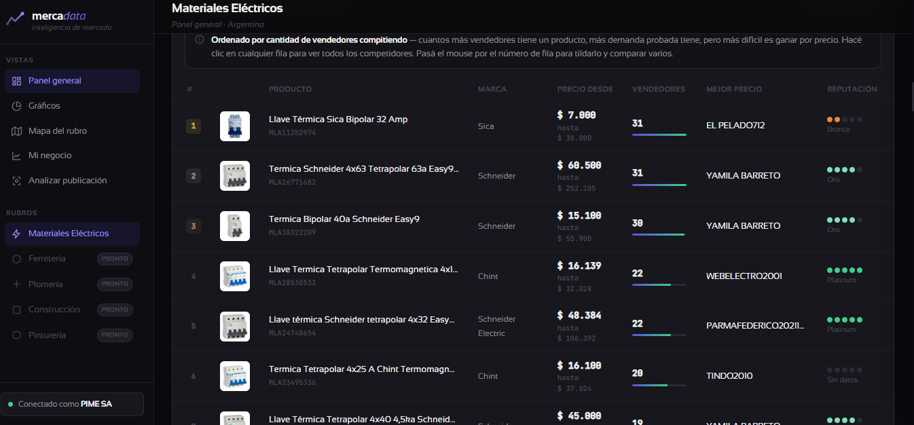
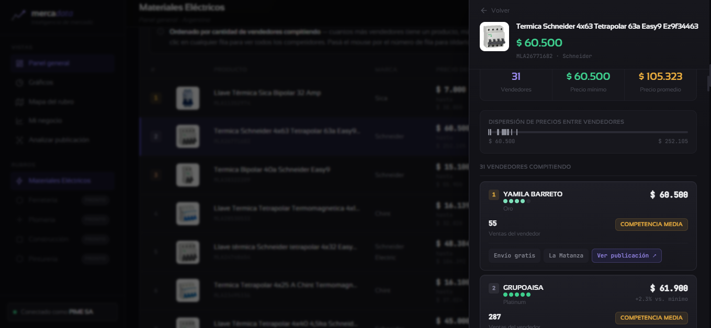

# Mercadata

**Inteligencia de mercado para vendedores de Mercado Libre Argentina.**

Mercadata conecta con tu cuenta de Mercado Libre y cruza datos públicos del catálogo oficial para responder tres preguntas que todo vendedor necesita, pero que ML no te muestra de forma directa: qué se vende y a qué precio, quién domina la competencia de cada producto, y dónde hay huecos de mercado sin explotar.

No es una herramienta de gestión de ventas ni de publicación de productos — es puramente de lectura y análisis. Corre 100% en tu computadora, sin desplegar nada a un servidor externo.

---

## Capturas

Aquí puedes ver la interfaz de usuario de Mercadata y sus principales herramientas de análisis:

### Panel General (Dashboard)

*Vista principal del panel general con el buscador por categoría, métricas agregadas (productos en catálogo, rango de precios, vendedor dominante) y lecturas automáticas generadas por el motor de insights.*

### Encontrar el Menor Precio (Analizar Publicación)

*Pegá el link directo de cualquier publicación (tuya o de la competencia) y el sistema rastreará al instante a todos los vendedores reales de ese mismo producto para mostrarte exactamente cuál es el precio más bajo del mercado.*

### Mapa de Oportunidad (Gráficos)

*Visualización gráfica que muestra cada producto como un punto. Cruza la cantidad de vendedores compitiendo frente al precio mínimo para detectar rápidamente huecos de mercado.*


### Panel de Competencia

*Análisis detallado al abrir un producto del catálogo (ej. Termica Schneider). Muestra la dispersión de precios y la lista completa de vendedores compitiendo, ordenados por precio, incluyendo su nivel de reputación y ventas.*


### Analizar Publicación

*Módulo que permite pegar el link directo de cualquier publicación de Mercado Libre, identificarla dentro del catálogo oficial y compararla instantáneamente contra el 100% de los vendedores reales de ese mismo producto.*
---

## Qué resuelve

Mercado Libre no permite buscar publicaciones ajenas por API si tu app no está certificada (y certificarse exige USD 1.5M de GMV mensual combinado entre usuarios — inalcanzable para una herramienta interna de un solo vendedor). En vez de pelear contra esa restricción con scraping o trucos para esquivar límites, Mercadata **pivotea al catálogo oficial de productos** de ML: cada producto de catálogo agrupa a todos los vendedores que lo ofrecen hoy, con precio, reputación y logística — exactamente el dato que hace falta para un análisis de competencia serio, sin depender de heurísticas de texto ni de datos no oficiales.

## Funcionalidades

### Dashboard del rubro
Buscador sobre el catálogo oficial, filtrado por categoría y tipo de producto (`domain_id`) para eliminar ruido de fichas importadas o de rubros ajenos. Por cada producto: cantidad de vendedores compitiendo, rango de precios, vendedor con mejor precio y su reputación. Comparador de hasta 4 productos lado a lado, filtro por marca con un clic, export a CSV.

### Panel de competencia
Al abrir un producto: todos los vendedores activos ordenados por precio, dispersión visual de precios, quién ganó el "buy box" de ML (el algoritmo no siempre elige el más barato — pesan también reputación y logística), y un botón directo a la publicación real de cada vendedor en Mercado Libre.

### Gráficos y lecturas automáticas
Mapa de oportunidad (vendedores × precio × dispersión), participación y posicionamiento de precios por marca, productos más disputados, vendedores con más presencia, distribución de reputación y de política de envíos. Un motor de insights determinístico traduce esos datos en frases accionables ("la marca X es la más disputada", "estos productos tienen 2 o menos vendedores: puerta de entrada con poca competencia").

### Mapa del rubro
Compara todas las subcategorías del rubro entre sí — nivel de competencia promedio, precio típico, cuántos productos tienen pocos vendedores, marca dominante — para detectar de un vistazo dónde conviene entrar.

### Productos equivalentes
Para cualquier producto, encuentra sustitutos de otras marcas con las mismas especificaciones técnicas (comparando atributos estructurados del catálogo: polos, amperaje, potencia, tensión, medidas), no por coincidencia de texto. Muestra si tu precio de referencia está por encima o por debajo de la mediana de esos equivalentes.

### Analizar publicación
Pegás el link de cualquier publicación de ML (propia o de un competidor) y el sistema la identifica dentro del catálogo oficial para compararla contra el resto de los vendedores. Si es tuya, además trae ventas y visitas reales del período y el precio recomendado por ML para ganar el catálogo (`price_to_win`).

### Mi Negocio
Datos reales y propios de tu cuenta — los únicos que ML expone sin restricciones de certificación: ventas filtrables por fecha, visitas, conversión, tus productos más vendidos y precio para ganar por publicación.

### Alertas
- **Movimientos de precio del rubro**: qué productos subieron o bajaron desde la última vez que corriste un análisis de esa categoría (requiere historial: se guarda automáticamente en cada corrida, sin llamadas extra a la API).
- **Te están bajando el precio**: cruza tus propias publicaciones activas contra el resto de los vendedores de cada producto de catálogo, en tiempo real, y te avisa en cuáles quedaste por encima del precio más bajo — con link directo a la publicación del competidor.
- **Vendedor a vigilar**: evolución en el tiempo de tu competidor dominante (en cuántos productos aparece, cuántas veces gana por precio).

## Arquitectura

```
Navegador (Chrome) ──HTTP──> Flask (localhost:5050) ──HTTPS──> api.mercadolibre.com
                                      │
                                      └──> SQLite local (historial de precios)
```

| Capa | Elección | Por qué |
|---|---|---|
| Backend | Python + Flask | Proxy autenticado hacia la API de ML; nunca se llama a ML directamente desde el navegador |
| Frontend | HTML + CSS + JS vanilla | Sin build step ni tooling — se abre y corre con solo Python instalado |
| Gráficos | Chart.js (CDN) | Sin dependencias npm |
| Historial | SQLite (`data/mercadata.db`) | Snapshots de precio/competencia por corrida, sin llamadas extra a la API |
| Sesión ML | OAuth Authorization Code, token en `.ml_token.json` | Refresh automático; nunca se toca la sesión personal de Chrome del usuario |

El sistema escala a nuevos rubros (ferretería, plomería, construcción...) sumando una entrada al array `CATEGORIES` en `static/app.js`, calibrada con datos reales de la API — no hace falta tocar el HTML ni el CSS.

## Principios de diseño

Este proyecto tiene líneas rojas explícitas, documentadas y no negociables en [`PROJECT_SPEC.md`](PROJECT_SPEC.md):

- Nunca scraping del HTML de Mercado Libre, ni con navegador headless ni con servicios de terceros.
- Nunca se usa la sesión personal de Chrome del usuario para automatizar nada.
- Nunca se fragmentan búsquedas para esquivar los límites anti-abuso de la API (el techo real es 200 resultados por búsqueda).
- Nunca se infieren ventas de terceros por diferencias de stock u otros trucos indirectos.
- El servidor solo escucha en `127.0.0.1`: ningún otro dispositivo de la red puede usar el token de acceso.

Cuando la API de Mercado Libre no permite algo, el sistema lo dice explícitamente en la interfaz en vez de rellenar con una estimación silenciosa — por ejemplo, el gráfico de marcas aclara que es una muestra sesgada y no el conteo real del catálogo.

## Instalación

Requiere Python 3.10+ y una app creada en el [portal de desarrolladores de Mercado Libre](https://developers.mercadolibre.com.ar/).

```powershell
# 1. Instalar dependencias
pip install -r requirements.txt

# 2. Copiar y completar las credenciales
copy .env.example .env
# completar ML_CLIENT_ID, ML_CLIENT_SECRET, SECRET_KEY

# 3. Arrancar
start.bat
# o directamente:
python app.py

# 4. Autorizar la cuenta (una sola vez, o cuando el token expire sin refresh_token válido)
# abrir http://localhost:5050/auth/setup
```

En el portal de ML, el Redirect URI debe ser `https://httpbin.org/get` (ML exige HTTPS; este truco evita necesitar un certificado propio para una app que corre 100% local). El código de autorización aparece en el JSON que devuelve httpbin — se copia y pega en `/auth/setup`.

## Estructura del proyecto

```
productos-+vendidos/
├── app.py                 # Backend Flask: OAuth, proxy autenticado a la API de ML, endpoints /api/*
├── requirements.txt        # flask, python-dotenv, requests
├── .env                    # Credenciales reales (no versionar)
├── .env.example             # Plantilla de credenciales
├── .ml_token.json          # Token OAuth persistido (no versionar)
├── data/
│   └── mercadata.db        # Historial de precios/vendedores (SQLite)
├── templates/
│   ├── index.html          # Layout principal (sidebar + vistas)
│   └── setup.html           # Autorización OAuth manual
├── static/
│   ├── style.css            # Design system
│   └── app.js               # Estado, fetch a /api/*, render de todas las vistas
└── PROJECT_SPEC.md          # Especificación viva: arquitectura, límites de la API, líneas rojas
```

## Limitaciones conocidas

- **Sin `sold_quantity` de terceros**: Mercado Libre no expone ventas por publicación ajena vía API sin certificación. Se usa como proxy la cantidad de vendedores compitiendo y su reputación/volumen histórico de cuenta.
- **Techo de 200 resultados por búsqueda**: `limit` y `offset` de `/products/search` están limitados por ML del lado del servidor. El sistema siempre lo deja explícito cuando el catálogo real es más grande que lo analizado.
- **Marcas por muestra, no por conteo real**: ninguna búsqueda de texto da una muestra representativa de marcas — es una limitación medida y documentada de la API, no un bug.
- **Rubros sin cobertura de catálogo**: algunos tipos de producto (ej. motores, transformadores de audio) casi no existen como catálogo oficial en ML Argentina y se venden como publicaciones sueltas; quedan fuera del análisis por diseño.

El detalle completo, con las mediciones que lo respaldan, está en [`PROJECT_SPEC.md`](PROJECT_SPEC.md).

## Roadmap

- [x] Persistencia histórica de precios y vendedores (SQLite)
- [x] Calibración de subcategorías con datos reales de la API
- [x] Identificación de publicaciones de terceros sin acceso directo a `/items/{id}`
- [x] Productos equivalentes por especificación técnica
- [x] Alertas de movimiento de precio del rubro
- [x] Alertas de undercut sobre publicaciones propias
- [ ] Expansión a nuevos rubros (ferretería, plomería, construcción, pinturería)
- [ ] Certificación de la app en ML — descartado: requisito de GMV inalcanzable para un vendedor único

---

_Proyecto interno, de uso personal. No afiliado a Mercado Libre._
